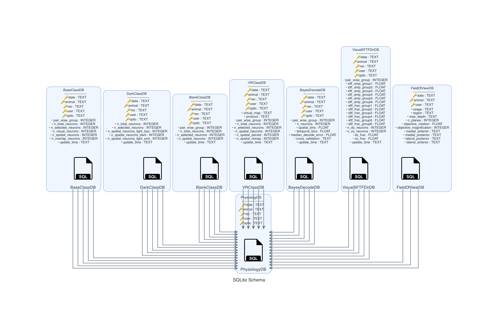

# rscvp

**Anterior and posterior retrosplenial cortex form complementary visuospatial circuits in the mouse**

Yu-Ting Wei et al., 2026. *Nature Communications*

[](https://rscvp.readthedocs.io/en/latest/)
[](https://doi.org/10.5281/zenodo.18234117)

## Overview

This repository contains the complete analysis pipeline for the RSC (Retrosplenial Cortex) visuo-spatial project,
including:

- **Two-photon calcium imaging analysis** - Neural activity recordings during visual and spatial tasks
- **Anatomical tracing analysis** - Retrograde tracing and CCF registration pipeline
- **Behavioral analysis** - Virtual reality and head-fixed treadmill paradigms
- **Statistical modeling** - Bayesian decoding, tuning curve analysis, and reliability metrics

### Dependencies

This pipeline builds on:

- [argclz](https://argp.readthedocs.io/en/latest/) - CLI pipeline framework
- [neuralib](https://neuralib.readthedocs.io/en/latest/index.html) - Core analysis utilities
- [Stimpy](https://bitbucket.org/activision/stimpy/src/master) - Visual stimulus presentation (internal)

------------------------------

## See the detail information in [documentation](https://rscvp.readthedocs.io/en/latest/)

## How to set up in a local machine?

### 1. Clone or download the project locally

### 2. Create uv or conda environment

- uv (recommended)

```bash
    # Create virtual environment
    uv venv

    # Activate environment
    source .venv/bin/activate         # Linux/macOS
    .venv\Scripts\activate           # Windows

    # Install package in development mode
    uv pip install -e .[all]
```

- conda

```bash
    # Create conda environment with Python 3.10
    conda create -n rscvp python=3.11 -y

    # Activate environment
    conda activate rscvp

    # Install package in development mode
    pip install -e .[all]
```

## Run Example in Google Colab

### Physiology Dataset

[](https://colab.research.google.com/drive/1HX13mWIPFcTctTZbPsXYmQsD_4D9iJpf?usp=sharing)

### Histology Dataset

[](https://colab.research.google.com/drive/1Xf8Ukc0PwpyllUyZtD6zhQgzJT40XmQo?usp=sharing)


## Analysis Workflow

### Physiological dataset


### Histological dataset


## Code availability

- Code for reproduce the paper figure are wei2026-v* git tagged
- The archived code are accessible
  via [](https://doi.org/10.5281/zenodo.18234117)

## Data Availability

All datasets are publicly available on Zenodo and Figshare with DOIs:

### Example Dataset (Demo & Colab)

[](https://doi.org/10.5281/zenodo.17639283)
[](https://figshare.com/s/88802ef91b1f519f9075)

Contains:

- Example two-photon imaging data (suite2p extracted)
- Example behavioral data
- Anatomical tracing results (CCF-registered)
- Processed aggregated dataframes
- Pre-computed analysis caches
- SQL Database for session information

**Note:** The dataset is automatically downloaded when running demo scripts or Colab notebooks.

### SQLite Database



## Citation

If you use this code or data in your research, please cite:

```bibtex
@article{wei2026rsc,
  title={Anterior and posterior retrosplenial cortex form complementary visuospatial circuits in the mouse},
  author={Wei, Yu-Ting and others},
  journal={Nature Communications},
  year={2026},
  doi={10.5281/zenodo.18234117}
}
```

## Contact

**Yu-Ting Wei**
Email: ytsimon2004@gmail.com
GitHub: [@ytsimon2004](https://github.com/ytsimon2004)
