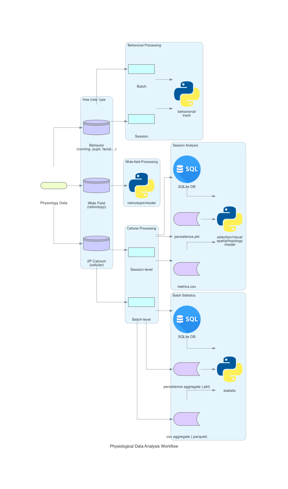
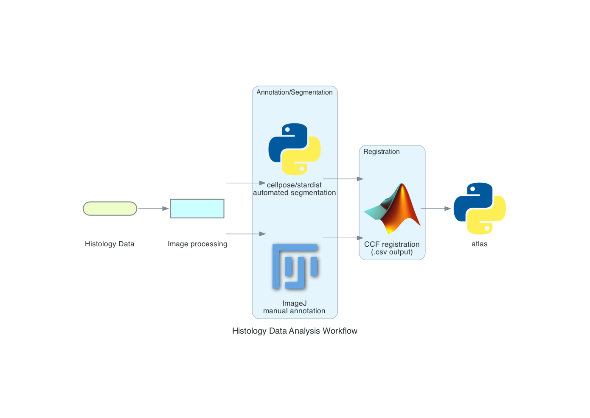

# rscvp

[](https://rscvp.readthedocs.io/en/latest/)

- Pipeline for RSC visuo-spatial project (rscvp) analysis
- Data are acquired using internal customized package [Stimpy](https://bitbucket.org/activision/stimpy/src/master)
- Core analysis largely depending on the customized
  package [neuralib](https://neuralib.readthedocs.io/en/latest/index.html) and cli
  pipeline [argclz](https://argp.readthedocs.io/en/latest/)

------------------------------

## See the detail information in [documentation](https://rscvp.readthedocs.io/en/latest/)

## How to set up in a local machine?

### 1. Clone or download the project locally

### 2. Create uv or conda environment

- uv (recommended)

```bash
    # Create virtual environment
    uv venv

    # Activate environment
    source .venv/bin/activate         # Linux/macOS
    .venv\Scripts\activate           # Windows

    # Install package in development mode
    uv pip install -e .
```

- conda

```bash
    # Create conda environment with Python 3.10
    conda create -n rscvp python=3.10 -y

    # Activate environment
    conda activate rscvp

    # Install package in development mode
    pip install -e .
```

## Run Example in Google Colab

### Physiology Dataset

[](https://colab.research.google.com/drive/19CfLB2izsMFZvaanJwkDSIzG8LZNhoAh#scrollTo=VIPD4N6zjWh-)

### Histology Dataset

[](https://colab.research.google.com/drive/1Xf8Ukc0PwpyllUyZtD6zhQgzJT40XmQo#scrollTo=_N-nXAvsbVxN)

## Annotation for published figures in the source code

- Checkout class/function with `@publish_annotation('main' | 'sup',project='rscvp', figure=[FIGURE_NUMBER])` decorator

```python
from neuralib.util.verbose import publish_annotation


@publish_annotation('main', project='rscvp', figure=['fig.1A-1D', 'fig.2A-2F'], as_doc=True)
class FigureClass:

  @publish_annotation('main', project='rscvp', figure='fig.1B', as_doc=True)
  def run_figure1(self):
    ...

  @publish_annotation('main', project='rscvp', figure='fig.2C', as_doc=True)
  def run_figure2(self):
    ...

  def _prepare_data(self):
    pass

```

## Analysis Workflow

### Physiological dataset



### Histological dataset



## Contact

Yu-Ting Wei (ytsimon2004@gmail.com)
