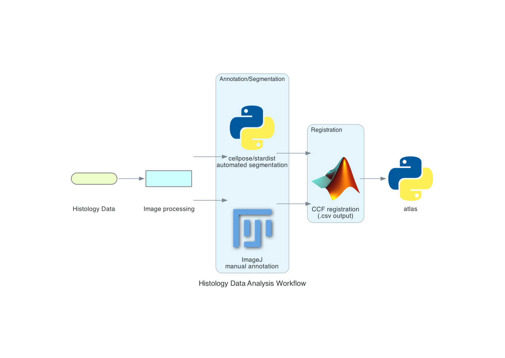

Welcome to rscvp's documentation!
====================================

Local Installation
-------------------------

.. note::

    No need if you prefer run on the google colab notebook

1. Clone the repo from `rscvp <https://github.com/ytsimon2004/rscvp>`_

UV Environment (Recommended)
^^^^^^^^^^^^^^^^^^^^^^^^^^^^^^

UV is a fast Python package installer and resolver. If you don't have UV installed, install it first:

.. seealso::

    https://docs.astral.sh/uv/getting-started/installation/

Then set up the environment:

.. code-block:: bash

    # Create virtual environment
    uv venv

    # Activate environment
    source .venv/bin/activate         # Linux/macOS
    .venv\Scripts\activate           # Windows

    # Install package in development mode
    uv pip install -e .

Conda Environment
^^^^^^^^^^^^^^^^^^^^^^^^^^^^^^

If you prefer using Conda for environment management:

.. code-block:: bash

    # Create conda environment with Python 3.10)
    conda create -n rscvp python=3.10 -y

    # Activate environment
    conda activate rscvp

    # Install package in development mode
    pip install -e .

Analysis Workflow
-------------------------

Physiological dataset
^^^^^^^^^^^^^^^^^^^^^^

|phys workflow|

Anatomical dataset
^^^^^^^^^^^^^^^^^^^^^^

|hist workflow|

.. |phys workflow| image:: _static/physiological_data_analysis_workflow.png

Data Structure
-------------------------

.. toctree::
   :maxdepth: 1

   data_structure/physiology
   data_structure/anatomy

Demo Run
-------------------------

.. toctree::
   :maxdepth: 2

   demo/index

Figure Instruction
-------------------------

.. toctree::
   :maxdepth: 2

   fig_instruction/index

API Reference
-------------------------

.. toctree::
   :maxdepth: 1
   :caption: Modules

   api/rscvp